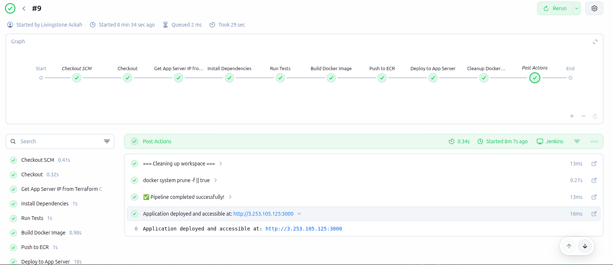
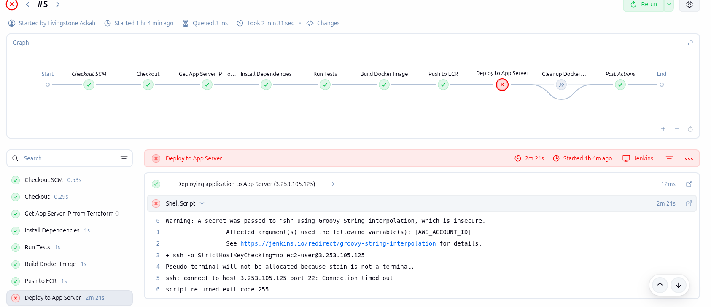
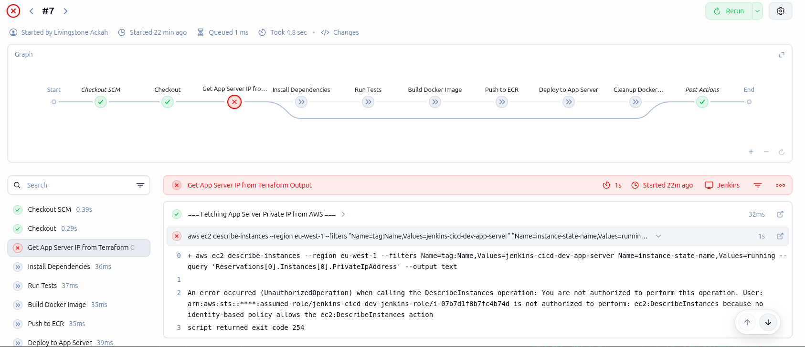

# Complete CI/CD Pipeline with Jenkins

[](./assets/build9_pass.png)

A production-ready CI/CD pipeline that automates the entire software delivery process from code commit to production deployment using Jenkins, Docker, AWS ECR, Terraform, and Ansible.

## 📋 Table of Contents

- [Overview](#overview)
- [Project Architecture](#project-architecture)
- [Features](#features)
- [Prerequisites](#prerequisites)
- [Project Structure](#project-structure)
- [Quick Start](#quick-start)
- [Detailed Setup Guide](#detailed-setup-guide)
- [Pipeline Stages](#pipeline-stages)
- [Troubleshooting](#troubleshooting)
- [Screenshots](#screenshots)
- [Technologies Used](#technologies-used)
- [Author](#author)

## 🎯 Overview

This project demonstrates a complete DevOps workflow implementing Infrastructure as Code (IaC), Configuration Management, Containerization, and Continuous Integration/Continuous Deployment (CI/CD) best practices.

### What This Pipeline Does:

1. **Provisions Infrastructure** - Creates AWS resources (VPC, EC2, Security Groups, ECR)
2. **Configures Servers** - Installs and configures Jenkins and Application servers
3. **Automates Testing** - Runs unit tests on every code change
4. **Builds Container Images** - Creates Docker images with proper versioning
5. **Stores Artifacts** - Pushes images to AWS ECR private registry
6. **Deploys Applications** - Automatically deploys to production server
7. **Monitors Health** - Verifies deployment success

## 🏗️ Project Architecture

```
┌─────────────┐         ┌──────────────┐         ┌─────────────┐
│   GitHub    │────────▶│   Jenkins    │────────▶│  App Server │
│ Repository  │         │    Server    │         │  (Docker)   │
└─────────────┘         └──────────────┘         └─────────────┘
                               │                         │
                               │                         │
                               ▼                         ▼
                        ┌──────────────┐         ┌─────────────┐
                        │   AWS ECR    │         │  Port 3000  │
                        │   Registry   │         │   (HTTP)    │
                        └──────────────┘         └─────────────┘
```

**Infrastructure Components:**
- **VPC**: Isolated network environment (10.0.0.0/16)
- **EC2 Instances**: Jenkins server (t3.medium), App server (t3.micro)
- **ECR**: Private Docker registry
- **Security Groups**: Granular access control
- **IAM Roles**: Least privilege permissions
- **S3**: Terraform state backend

*Architecture diagram coming soon*

## ✨ Features

### Infrastructure as Code (Terraform)
- ✅ Modular Terraform design for reusability
- ✅ Separate modules for networking, security, compute, and ECR
- ✅ Remote state management in S3
- ✅ Environment-specific configurations (dev.tfvars)

### Configuration Management (Ansible)
- ✅ Automated server provisioning
- ✅ Jenkins installation and configuration
- ✅ Docker setup on both servers
- ✅ Swap space configuration for performance
- ✅ Idempotent playbooks

### CI/CD Pipeline
- ✅ Automated builds triggered from GitHub
- ✅ Unit testing with Jest
- ✅ Docker image creation with semantic versioning
- ✅ Automated push to AWS ECR
- ✅ Zero-downtime deployments
- ✅ Health check validation
- ✅ Automatic cleanup of old images

### Security
- ✅ IAM roles instead of AWS credentials
- ✅ Security group rules with least privilege
- ✅ Private VPC deployment
- ✅ SSH key-based authentication
- ✅ ECR image scanning
- ✅ Secrets managed via Jenkins credentials

## 📦 Prerequisites

Before you begin, ensure you have:

- **AWS Account** with appropriate permissions
- **AWS CLI** installed and configured (`aws configure`)
- **Terraform** >= 1.0 ([Install](https://www.terraform.io/downloads))
- **Ansible** >= 2.9 ([Install](https://docs.ansible.com/ansible/latest/installation_guide/intro_installation.html))
- **Git** for version control
- **SSH Key Pair** created in AWS (named `AutoKeyPair`)
- **S3 Bucket** for Terraform state: `terraform-state-management-a-simple-jenkins-project`
- **GitHub Account** for repository hosting

### System Requirements:
- Linux/macOS (WSL2 for Windows)
- 8GB RAM minimum
- 20GB free disk space

## 📁 Project Structure

```
Jenkins-project/
│
├── terraform/                   # Infrastructure as Code
│   ├── main.tf                 # Root module orchestration
│   ├── provider.tf             # AWS provider configuration
│   ├── backend.tf              # S3 backend for state
│   ├── variable.tf             # Variable definitions
│   ├── output.tf               # Output values
│   ├── dev.tfvars              # Development environment config
│   ├── terraform.tfvars.example # Example configuration
│   │
│   ├── networking/             # VPC, Subnets, IGW, Route Tables
│   │   ├── main.tf
│   │   ├── output.tf
│   │   └── variable.tf
│   │
│   ├── security/               # Security Groups, IAM Roles
│   │   ├── main.tf
│   │   ├── output.tf
│   │   └── variable.tf
│   │
│   ├── compute/                # EC2 Instances
│   │   ├── main.tf
│   │   ├── output.tf
│   │   └── variable.tf
│   │
│   └── ecr/                    # Docker Registry
│       ├── main.tf
│       ├── output.tf
│       └── variable.tf
│
├── ansible/                    # Configuration Management
│   ├── ansible.cfg            # Ansible configuration
│   ├── inventory.ini          # Auto-generated by Terraform
│   │
│   └── playbooks/
│       ├── jenkins.yml        # Jenkins server setup
│       └── app.yml            # Application server setup
│
├── app/                       # Node.js Application
│   ├── index.js              # Express.js server
│   ├── app.test.js           # Jest unit tests
│   ├── package.json          # Dependencies
│   ├── Dockerfile            # Container definition
│   └── .dockerignore         # Docker build exclusions
│
├── assets/                    # Documentation assets
│   ├── build5_fail.png       # Failed build example
│   ├── build7_fail.png       # Debugging process
│   └── build9_pass.png       # Successful pipeline
│
├── Jenkinsfile               # CI/CD Pipeline definition
├── JENKINS_SETUP.md          # Jenkins configuration guide
├── .gitignore                # Git exclusions
└── README.md                 # This file
```

## 🚀 Quick Start

### Option 1: Deploy Everything (5-10 minutes)

```bash
# 1. Clone the repository
git clone https://github.com/KofiAckah/A-simple-Jenkins-project.git
cd A-simple-Jenkins-project

# 2. Configure Terraform variables
cd terraform
cp terraform.tfvars.example dev.tfvars
nano dev.tfvars  # Edit with your AWS region, IP address, key pair name

# 3. Deploy infrastructure
terraform init
terraform apply -var-file=dev.tfvars -auto-approve

# Wait 2-3 minutes for instances to boot

# 4. Configure servers with Ansible
cd ../ansible
cp ~/Downloads/AutoKeyPair.pem .  # Copy your AWS key pair
chmod 400 AutoKeyPair.pem
ansible-playbook playbooks/jenkins.yml
ansible-playbook playbooks/app.yml

# 5. Get Jenkins access information
cd ../terraform
JENKINS_IP=$(terraform output -raw jenkins_public_ip)
echo "Jenkins URL: http://$JENKINS_IP:8080"

# 6. Get Jenkins initial password
ssh -i ../ansible/AutoKeyPair.pem ec2-user@$JENKINS_IP \
  "sudo cat /var/lib/jenkins/secrets/initialAdminPassword"
```

### Option 2: Step-by-Step (See Detailed Setup Guide)

## 📖 Detailed Setup Guide

### Step 1: Infrastructure Provisioning with Terraform

#### 1.1 Configure Variables

Edit `terraform/dev.tfvars`:

```hcl
# --- General Config ---
aws_region   = "eu-west-1"          # Your AWS region
project_name = "jenkins-cicd"
environment  = "dev"

# --- Networking ---
vpc_cidr           = "10.0.0.0/16"
public_subnet_cidr = "10.0.1.0/24"

# --- Security ---
ssh_allowed_ip = "YOUR.IP.ADDRESS.HERE/32"  # Get from: curl ifconfig.me

# --- EC2 ---
jenkins_instance_type = "t3.medium"  # Jenkins needs more resources
app_instance_type     = "t3.micro"   # Lightweight app server
key_name              = "AutoKeyPair" # Must exist in AWS Console
```

#### 1.2 Deploy Infrastructure

```bash
cd terraform

# Initialize Terraform (downloads providers)
terraform init

# Preview changes
terraform plan -var-file=dev.tfvars

# Apply infrastructure
terraform apply -var-file=dev.tfvars

# Note the outputs - you'll need these IPs!
```

**Terraform Outputs:**
```
jenkins_public_ip = "18.202.36.235"
app_public_ip = "3.253.105.125"
ecr_repository_url = "605134436600.dkr.ecr.eu-west-1.amazonaws.com/jenkins-cicd-app"
vpc_id = "vpc-0ff2684852c02b9ec"
```

### Step 2: Server Configuration with Ansible

#### 2.1 Verify Inventory

Terraform automatically generates `ansible/inventory.ini`:

```ini
[jenkins_server]
18.202.36.235 ansible_user=ec2-user ansible_ssh_private_key_file=./AutoKeyPair.pem

[app_server]
3.253.105.125 ansible_user=ec2-user ansible_ssh_private_key_file=./AutoKeyPair.pem

[all:vars]
ansible_python_interpreter=/usr/bin/python3
```

#### 2.2 Configure Jenkins Server

```bash
cd ../ansible

# Copy your SSH key
cp ~/path/to/AutoKeyPair.pem .
chmod 400 AutoKeyPair.pem

# Run Jenkins playbook (installs Java, Jenkins, Docker, Git)
ansible-playbook playbooks/jenkins.yml
```

**What this playbook does:**
- ✅ Updates system packages
- ✅ Installs Java 17 (Jenkins requirement)
- ✅ Adds Jenkins repository and GPG key
- ✅ Installs and starts Jenkins service
- ✅ Installs Docker and Git
- ✅ Adds jenkins user to docker group
- ✅ Creates 2GB swap file for performance

#### 2.3 Configure App Server

```bash
# Run App server playbook (installs Docker, Git)
ansible-playbook playbooks/app.yml
```

### Step 3: Jenkins Configuration

#### 3.1 Access Jenkins

```bash
# Get Jenkins IP
JENKINS_IP=$(cd ../terraform && terraform output -raw jenkins_public_ip)

# Get initial admin password
ssh -i AutoKeyPair.pem ec2-user@$JENKINS_IP \
  "sudo cat /var/lib/jenkins/secrets/initialAdminPassword"
```

Open browser: `http://<jenkins-ip>:8080`

#### 3.2 Complete Setup Wizard

1. Paste the initial admin password
2. Click **"Install suggested plugins"**
3. Create your admin user
4. Set Jenkins URL (use the default)
5. Click **"Start using Jenkins"**

#### 3.3 Install Additional Plugins

Go to **Manage Jenkins → Plugins → Available**

Search and install:
- ✅ **Docker Pipeline**
- ✅ **SSH Agent**
- ✅ **AWS Credentials** (if not already installed)

Restart Jenkins after installation.

#### 3.4 Configure Credentials

**A) AWS Account ID:**
- Navigate: **Manage Jenkins → Credentials → System → Global credentials → Add Credentials**
- **Kind:** Secret text
- **Secret:** Your AWS Account ID (run: `aws sts get-caller-identity --query Account --output text`)
- **ID:** `aws-account-id`
- **Description:** AWS Account ID for ECR
- Click **Create**

**B) EC2 SSH Key:**
- **Kind:** SSH Username with private key
- **ID:** `ec2-ssh-key`
- **Description:** EC2 SSH Key for App Server
- **Username:** `ec2-user`
- **Private Key:** → Select "Enter directly" → Paste contents of `AutoKeyPair.pem`
- Click **Create**

#### 3.5 Configure AWS CLI on Jenkins Server

```bash
# SSH into Jenkins server
ssh -i AutoKeyPair.pem ec2-user@<jenkins-ip>

# Switch to jenkins user
sudo su - jenkins

# Configure AWS CLI
aws configure
# AWS Access Key ID: [Your Key]
# AWS Secret Access Key: [Your Secret]
# Default region: eu-west-1
# Default output format: json

# Test permissions
aws sts get-caller-identity
aws ecr describe-repositories --region eu-west-1

# Exit back to ec2-user
exit
exit
```

#### 3.6 Install Node.js on Jenkins Server

```bash
ssh -i AutoKeyPair.pem ec2-user@<jenkins-ip>

# Install Node.js and npm
sudo yum install -y nodejs npm

# Verify installation
node --version  # Should show v18+
npm --version

exit
```

### Step 4: Create Jenkins Pipeline

#### 4.1 Create New Pipeline Job

1. Jenkins Dashboard → **New Item**
2. **Name:** `nodejs-cicd-pipeline`
3. **Type:** Pipeline
4. Click **OK**

#### 4.2 Configure Pipeline

**General Section:**
- ☑ GitHub project
- **Project URL:** `https://github.com/KofiAckah/A-simple-Jenkins-project/`

**Build Triggers:**
- ☑ Poll SCM
- **Schedule:** `H/5 * * * *` (poll every 5 minutes)

**Pipeline Section:**
- **Definition:** Pipeline script from SCM
- **SCM:** Git
- **Repository URL:** `https://github.com/KofiAckah/A-simple-Jenkins-project.git`
- **Credentials:** None (for public repo)
- **Branch Specifier:** `*/main`
- **Script Path:** `Jenkinsfile`

Click **Save**

### Step 5: Run the Pipeline!

1. Click **"Build Now"**
2. Monitor the build in **"Console Output"**
3. Watch each stage execute:
   - ✅ Checkout code from GitHub
   - ✅ Get App Server IP from AWS
   - ✅ Install dependencies
   - ✅ Run tests
   - ✅ Build Docker image
   - ✅ Push to ECR
   - ✅ Deploy to App Server
   - ✅ Cleanup old images

## 🔄 Pipeline Stages

The [`Jenkinsfile`](Jenkinsfile) defines 8 stages:

### 1. Checkout
```groovy
checkout scm
```
Clones the latest code from GitHub repository.

### 2. Get App Server IP
```groovy
aws ec2 describe-instances --query 'Reservations[0].Instances[0].PrivateIpAddress'
```
Dynamically queries AWS to find the App Server's private IP for deployment.

### 3. Install Dependencies
```bash
npm install
```
Installs Node.js dependencies defined in `package.json`.

### 4. Run Tests
```bash
npm test
```
Executes Jest unit tests to ensure code quality.

### 5. Build Docker Image
```bash
docker build -t <ecr-repo>:<build-number> .
docker tag <ecr-repo>:<build-number> <ecr-repo>:latest
```
Creates container image with build number and latest tags.

### 6. Push to ECR
```bash
aws ecr get-login-password | docker login --username AWS --password-stdin <ecr-registry>
docker push <ecr-repo>:<build-number>
docker push <ecr-repo>:latest
```
Uploads images to AWS ECR private registry.

### 7. Deploy to App Server
```bash
ssh ec2-user@<app-private-ip>
docker pull <ecr-repo>:latest
docker stop nodeapp && docker rm nodeapp
docker run -d --name nodeapp -p 3000:3000 <ecr-repo>:latest
curl -f http://localhost:3000  # Health check
```
SSHs to App Server, pulls latest image, and deploys container.

### 8. Cleanup
```bash
docker images | grep <build-number> | sort -rn | tail -n +4 | xargs docker rmi
```
Removes old images, keeping only the last 3 builds.

## 🧪 Testing the Application

### Local Testing
```bash
cd app
npm install
npm test
```

### Access Deployed Application
```bash
# Get App Server IP
APP_IP=$(cd terraform && terraform output -raw app_public_ip)

# Test homepage
curl http://$APP_IP:3000
# Output: Hello from Jenkins Pipeline!

# Test health endpoint
curl http://$APP_IP:3000/health
# Output: {"status":"UP"}

# Open in browser
echo "Visit: http://$APP_IP:3000"
```

## 🐛 Troubleshooting

### Common Issues & Solutions

#### Issue 1: SSH Connection Timeout to App Server

**Symptom:** Jenkins can't SSH to App Server

**Solution:**
```bash
# Check security group allows Jenkins → App Server SSH
aws ec2 describe-security-groups \
  --region eu-west-1 \
  --filters "Name=tag:Name,Values=jenkins-cicd-dev-app-sg" \
  --query 'SecurityGroups[0].IpPermissions'

# Should show ingress rule from Jenkins security group
```

#### Issue 2: AWS Permission Denied (DescribeInstances)

**Symptom:** `UnauthorizedOperation: You are not authorized to perform: ec2:DescribeInstances`

**Solution:** Already fixed! The Jenkins IAM role has EC2 read permissions.

#### Issue 3: Docker Build Fails on Jenkins

**Symptom:** `docker: command not found`

**Solution:**
```bash
# SSH to Jenkins server
ssh -i AutoKeyPair.pem ec2-user@<jenkins-ip>

# Add jenkins user to docker group
sudo usermod -aG docker jenkins

# Restart Jenkins
sudo systemctl restart jenkins
```

#### Issue 4: npm install fails

**Symptom:** `npm: command not found`

**Solution:** Install Node.js on Jenkins server (see Step 3.6 above)

#### Issue 5: Terraform State Lock

**Symptom:** `Error acquiring the state lock`

**Solution:**
```bash
# Force unlock (use the Lock ID from error message)
terraform force-unlock <LOCK_ID>
```

### Debugging Tips

1. **Check Jenkins Console Output** - Most errors are visible here
2. **SSH to servers** - Manually test commands that fail
3. **Verify AWS resources** - Check EC2 console for instance status
4. **Test locally first** - Run npm test and docker build locally
5. **Check security groups** - Ensure proper ingress/egress rules

## 📸 Screenshots

### Failed Builds (Debugging Process)

Early builds encountered issues that were systematically resolved:


*Build #5: Initial failure - Missing inventory file configuration*


*Build #7: SSH connectivity issues - Security group configuration needed*

### Successful Pipeline


*Build #9: Complete success! All stages executed perfectly* ✅

**Pipeline Execution Summary:**
- ✅ **Checkout:** Code retrieved from GitHub
- ✅ **Get App Server IP:** AWS query successful (Private IP: 10.0.1.47)
- ✅ **Install Dependencies:** npm packages installed
- ✅ **Run Tests:** All Jest tests passed (2/2)
- ✅ **Build Docker Image:** Image created with tag `build:9`
- ✅ **Push to ECR:** Images pushed to registry
- ✅ **Deploy to App Server:** Container deployed and health check passed
- ✅ **Cleanup:** Old images removed

**Total Execution Time:** ~2 minutes

## 🛠️ Technologies Used

### Infrastructure & Cloud
- **Terraform** (v1.0+) - Infrastructure as Code
- **AWS** - Cloud provider
  - EC2 - Virtual servers
  - VPC - Network isolation
  - ECR - Container registry
  - IAM - Access management
  - S3 - State backend
- **Ansible** (v2.9+) - Configuration management

### CI/CD & DevOps
- **Jenkins** (v2.x) - Automation server
- **Docker** - Containerization
- **Git** - Version control
- **GitHub** - Code hosting

### Application
- **Node.js** (v18+) - Runtime
- **Express.js** (v4.18) - Web framework
- **Jest** (v29.7) - Testing framework

### Languages
- **HCL** - Terraform configuration
- **YAML** - Ansible playbooks
- **Groovy** - Jenkinsfile DSL
- **JavaScript** - Application code
- **Bash** - Shell scripting

## 🧹 Cleanup

To destroy all AWS resources and avoid charges:

```bash
cd terraform

# Preview what will be destroyed
terraform plan -destroy -var-file=dev.tfvars

# Destroy everything
terraform destroy -var-file=dev.tfvars -auto-approve
```

**Note:** This will delete:
- ✅ EC2 instances (Jenkins + App servers)
- ✅ Security groups
- ✅ VPC, subnets, route tables
- ✅ ECR repository and all images
- ✅ IAM roles and policies
- ❌ S3 bucket (manual deletion required)

## 📚 Learning Outcomes

This project demonstrates proficiency in:

1. **Infrastructure as Code** - Provisioning cloud resources programmatically
2. **Configuration Management** - Automated server setup and maintenance
3. **Containerization** - Docker best practices and registry management
4. **CI/CD Pipelines** - Automated testing, building, and deployment
5. **Cloud Security** - IAM roles, security groups, least privilege
6. **DevOps Best Practices** - Version control, automation, monitoring
7. **Problem Solving** - Debugging issues systematically (see screenshots)

## 🎓 Assignment Compliance

This project fulfills the "Complete CI/CD Pipeline (Jenkins)" assignment requirements:

✅ **Infrastructure Setup** - Terraform provisions all AWS resources  
✅ **Configuration Management** - Ansible configures servers  
✅ **Application Containerization** - Docker packages the Node.js app  
✅ **CI/CD Implementation** - Jenkins automates the entire pipeline  
✅ **Testing Integration** - Automated unit tests with Jest  
✅ **Deployment Automation** - Zero-touch deployment to production  
✅ **Documentation** - Comprehensive README and setup guide  
✅ **Version Control** - GitHub repository with proper .gitignore  
✅ **Security** - IAM roles, security groups, SSH keys

*For detailed Jenkins configuration instructions, see [JENKINS_SETUP.md](JENKINS_SETUP.md)*
